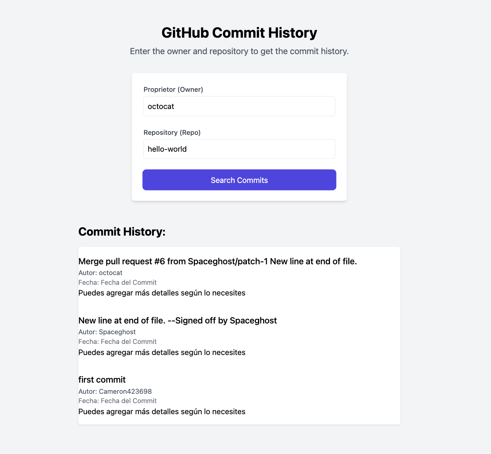

# Git Commit History Viewer

This project provides a web application that displays the git commit history of a specified repository. It's built using a backend server with Node.js and Express.js, and a frontend developed with Angular.

## Table of Contents

- [Prerequisites](#prerequisites)
- [Installation](#installation)
- [Running the Application](#running-the-application)
- [Usage](#usage)
- [Contributing](#contributing)
- [License](#license)

## Prerequisites

- Node.js
- Angular CLI

## Installation

1. Clone the repository:
   ```bash
   git clone <repository-url>
   cd [your-repository-name]

2. Backend Setup:
   ```bash
   cd backend
    npm install
   
4. Frontend Setup:
   ```bash
   cd frontend
   npm install


## Running the Project
1. Start the Backend Server:
   ```bash
   cd backend
   npm start
3. Start the Frontend Application:
   ```bash
   cd frontend
   ng serve
5. Open your web browser and navigate to http://localhost:4200.

## Usage
1. Enter the owner and repository name in the provided input fields.
2. Click the "Search" button.
3. View the commit history displayed below.
   
  


## Contributing
Pull requests are welcome. For major changes, please open an issue first to discuss what you would like to change.

## License
This project is licensed under the MIT License. See the LICENSE file for details.

